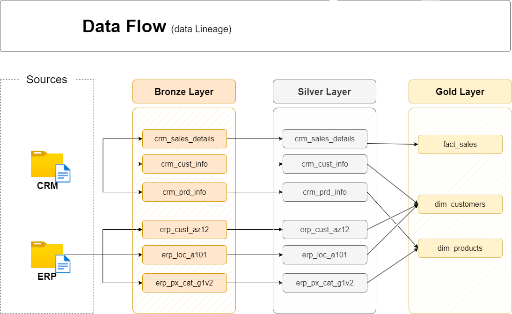
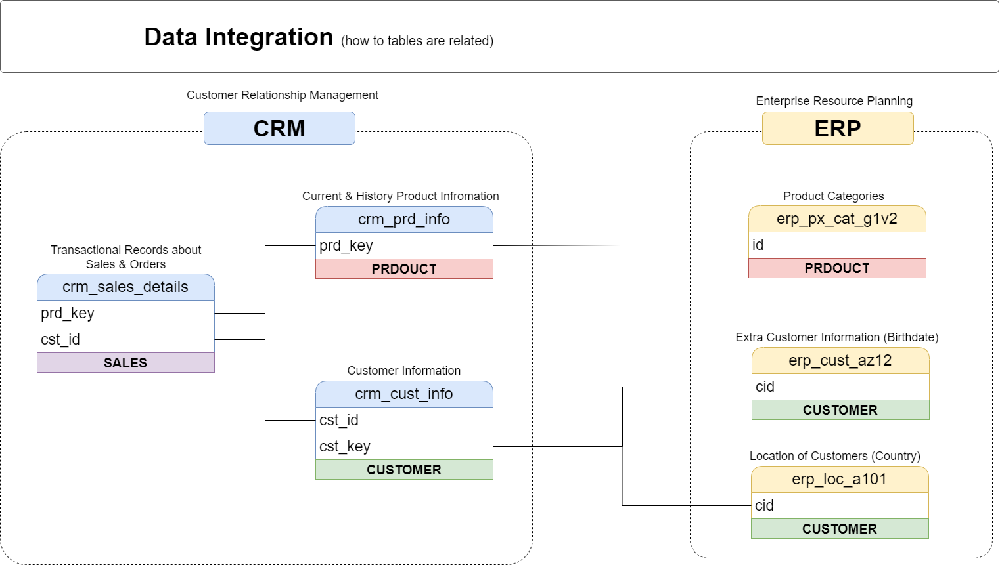
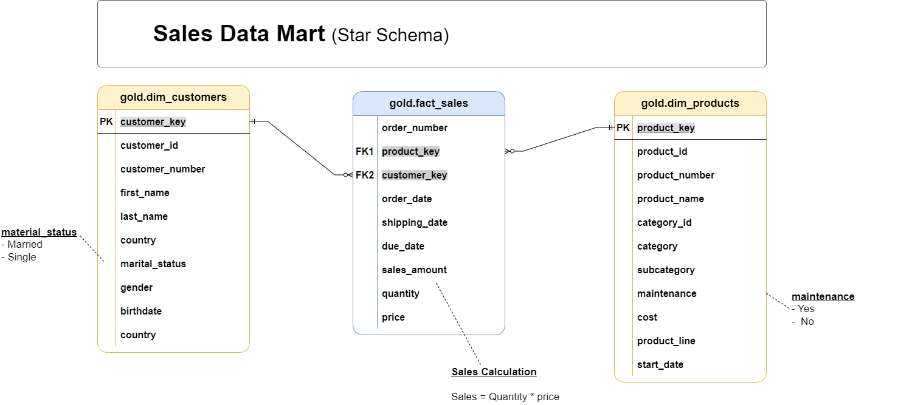

# 🏗️ SQL Data Warehouse Project

> A production-style, end-to-end data warehouse built with **SQL Server** and **T-SQL**, implementing the **Medallion Architecture** (Bronze → Silver → Gold) to integrate and transform raw CRM and ERP data into a clean, analytics-ready Sales Data Mart.

---

## 📑 Table of Contents

1. [Overview](#overview)
2. [Project Objectives](#project-objectives)
3. [Repository Structure](#repository-structure)
4. [Architecture](#architecture)
5. [Medallion Architecture](#medallion-architecture)
6. [Data Flow](#data-flow)
7. [Data Integration](#data-integration)
8. [Data Model](#data-model)
9. [ETL Workflow](#etl-workflow)
10. [Tables and Views Reference](#tables-and-views-reference)
11. [Data Quality Checks](#data-quality-checks)
12. [Business Rules Implemented](#business-rules-implemented)
13. [SQL Techniques Used](#sql-techniques-used)
14. [Naming Conventions](#naming-conventions)
15. [Technologies Used](#technologies-used)
16. [Setup Instructions](#setup-instructions)
17. [Usage Guide](#usage-guide)
18. [Sample Queries](#sample-queries)
19. [Key Learnings](#key-learnings)
20. [Future Enhancements](#future-enhancements)
21. [Author](#author)

---

## Overview

This repository contains a fully implemented **SQL Server data warehouse** built on the **Medallion Architecture** pattern. It ingests raw CSV source files from two operational systems — a **CRM** (Customer Relationship Management) and an **ERP** (Enterprise Resource Planning) — and progressively refines the data through three distinct layers until it is ready for business analytics and reporting.

The warehouse exposes a **Sales Data Mart** modeled as a **Star Schema**, with two dimension views (`dim_customers`, `dim_products`) and one fact view (`fact_sales`), making it immediately queryable for BI tools, ad-hoc SQL analysis, and machine learning pipelines.

All descriptions, transformations, and business rules documented here are derived exclusively from the SQL scripts, source data files, and documentation present in this repository.

---

## Project Objectives

| # | Objective |
|---|---|
| 1 | Preserve raw source data in the Bronze layer for full traceability and debugging. |
| 2 | Clean, standardize, and validate source data in the Silver layer. |
| 3 | Integrate CRM and ERP data into a unified dimensional model in the Gold layer. |
| 4 | Provide a Sales Mart for BI tools, ad-hoc SQL queries, and downstream analysis. |
| 5 | Support repeatable full-refresh loads using simple, idempotent SQL stored procedures. |

---

## Repository Structure

```
📦 sql-data-warehouse-project
├── 📄 README.md                              # Project documentation (this file)
│
├── 📁 datasets/
│   ├── 📁 source_crm/
│   │   ├── cust_info.csv                     # CRM customer records
│   │   ├── prd_info.csv                      # CRM product records
│   │   └── sales_details.csv                 # CRM sales transactions
│   └── 📁 source_erp/
│       ├── CUST_AZ12.csv                     # ERP customer birthdate & gender data
│       ├── LOC_A101.csv                      # ERP customer location (country) data
│       └── PX_CAT_G1V2.csv                   # ERP product category mappings
│
├── 📁 docs/
│   ├── data_architecture.png                 # High-level architecture diagram
│   ├── Bronze, Silver, and Gold Layer Explanation .png  # Medallion layer comparison
│   ├── data_flow.png                         # Data lineage / flow diagram
│   ├── data_integration.png                  # Source table relationship diagram
│   ├── data_model.png                        # Star schema diagram
│   ├── data_catalog.md                       # Gold layer data catalog
│   └── naming_conventions.md                 # Naming conventions reference
│
├── 📁 scripts/
│   ├── init_database.sql                     # Creates DataWarehouse database & schemas
│   ├── 📁 bronze/
│   │   ├── ddl_bronze.sql                    # Creates Bronze layer tables
│   │   └── proc_load_bronze.sql              # Stored procedure: loads CSVs into Bronze
│   ├── 📁 silver/
│   │   ├── ddl_silver.sql                    # Creates Silver layer tables
│   │   └── proc_load_silver.sql              # Stored procedure: transforms Bronze → Silver
│   └── 📁 gold/
│       └── ddl_gold.sql                      # Creates Gold layer views (Star Schema)
│
└── 📁 test/
    ├── quality_checks_silver.sql             # Data quality validation for Silver layer
    └── quality_checks_gold.sql               # Data quality validation for Gold layer
```

---

## Architecture

The warehouse follows a classic **three-layer Medallion Architecture** hosted entirely within a single SQL Server database named `DataWarehouse`, with three schemas: `bronze`, `silver`, and `gold`.

<p align="center">
  
</p>

**Figure 1 — High-Level Architecture:** Shows how raw CSV files from CRM and ERP sources are ingested into the Bronze layer via stored procedures, progressively refined through the Silver layer, and finally exposed as business-ready Star Schema views in the Gold layer for consumption by BI tools, ad-hoc SQL queries, and machine learning pipelines.

### Layer Summary

| Layer | Schema | Object Type | Load Method | Role |
|---|---|---|---|---|
| **Bronze** | `bronze` | Tables | Full load — Truncate & Insert via `BULK INSERT` | Raw landing zone. Exact copy of source CSV data with no transformations. |
| **Silver** | `silver` | Tables | Full load — Truncate & Insert via stored procedure | Cleansed, standardized, and enriched integration layer. |
| **Gold** | `gold` | Views | No physical load — computed at query time | Business-ready dimensional layer (Star Schema) for analytics. |

---

## Medallion Architecture

Each layer in the Medallion Architecture serves a distinct purpose, targets a different audience, and applies a different level of transformation.

<p align="center">
  
</p>

**Figure 2 — Medallion Layer Comparison:** A detailed comparison of the Bronze, Silver, and Gold layers across definition, objective, object type, load method, data transformation, data modeling approach, and target audience.

| Attribute | 🟤 Bronze | ⚪ Silver | 🟡 Gold |
|---|---|---|---|
| **Definition** | Raw, unprocessed data as-is from sources | Clean & standardized data | Business-ready data |
| **Objective** | Traceability & debugging | Prepare data for analysis | Provide data for reporting & analytics |
| **Object Type** | Tables | Tables | Views |
| **Load Method** | Full load (Truncate & Insert) | Full load (Truncate & Insert) | No load |
| **Transformation** | None (as-is) | Cleaning, Standardization, Normalization, Derived Columns, Enrichment | Data Integration, Aggregation, Business Logic & Rules |
| **Data Modeling** | None (as-is) | None (as-is) | Star Schema, Flat Tables, Aggregated Objects |
| **Target Audience** | Data Engineers | Data Analysts, Data Engineers | Data Analysts, Business Users |

---

## Data Flow

The diagram below illustrates the full **data lineage** — how each source table flows through each layer of the warehouse to produce the final Gold objects.

<p align="center">
  
</p>

**Figure 3 — Data Flow (Lineage):** Traces each table from its source system (CRM or ERP) through the Bronze and Silver layers until it reaches one of the three Gold views — `fact_sales`, `dim_customers`, or `dim_products`.

### Source-to-Target Mapping

| Source File | Bronze Table | Silver Table | Gold View |
|---|---|---|---|
| `source_crm/cust_info.csv` | `bronze.crm_cust_info` | `silver.crm_cust_info` | `gold.dim_customers` |
| `source_crm/prd_info.csv` | `bronze.crm_prd_info` | `silver.crm_prd_info` | `gold.dim_products` |
| `source_crm/sales_details.csv` | `bronze.crm_sales_details` | `silver.crm_sales_details` | `gold.fact_sales` |
| `source_erp/CUST_AZ12.csv` | `bronze.erp_cust_az12` | `silver.erp_cust_az12` | `gold.dim_customers` |
| `source_erp/LOC_A101.csv` | `bronze.erp_loc_a101` | `silver.erp_loc_a101` | `gold.dim_customers` |
| `source_erp/PX_CAT_G1V2.csv` | `bronze.erp_px_cat_g1v2` | `silver.erp_px_cat_g1v2` | `gold.dim_products` |

---

## Data Integration

The diagram below shows how tables from the two source systems are **related to each other** using shared business keys, enabling the Gold layer to join them into unified dimension and fact views.

<p align="center">
  
</p>

**Figure 4 — Data Integration (Table Relationships):** Illustrates how CRM tables (`crm_sales_details`, `crm_cust_info`, `crm_prd_info`) and ERP tables (`erp_cust_az12`, `erp_loc_a101`, `erp_px_cat_g1v2`) are linked using shared business keys (`cst_id`, `cst_key`/`cid`, `prd_key`/`id`) to form the integrated Gold layer.

### Integration Keys

| CRM Table | ERP Table | Join Key | Purpose |
|---|---|---|---|
| `crm_cust_info` (cst_key) | `erp_cust_az12` (cid) | Customer alphanumeric key | Enriches customer with ERP birthdate and gender |
| `crm_cust_info` (cst_key) | `erp_loc_a101` (cid) | Customer alphanumeric key | Enriches customer with ERP country/location |
| `crm_prd_info` (cat_id) | `erp_px_cat_g1v2` (id) | Product category ID | Enriches product with ERP category and subcategory |
| `crm_sales_details` (sls_cust_id) | `gold.dim_customers` (customer_id) | Customer numeric ID | Links sales transactions to the customer dimension |
| `crm_sales_details` (sls_prd_key) | `gold.dim_products` (product_number) | Product key | Links sales transactions to the product dimension |

---

## Data Model

The Gold layer is structured as a **Star Schema** Sales Data Mart, consisting of two dimension views and one central fact view.

<p align="center">
  
</p>

**Figure 5 — Star Schema (Sales Data Mart):** The central `gold.fact_sales` view connects to `gold.dim_customers` via `customer_key` and to `gold.dim_products` via `product_key`. The fact table captures sales transactions at the order-line grain; the sales amount is derived as `Sales = Quantity × Price`.

### Gold Layer Objects

| Object | Type | Grain | Key Columns |
|---|---|---|---|
| `gold.dim_customers` | View | One row per unique customer | `customer_key` (surrogate), `customer_id`, `customer_number` |
| `gold.dim_products` | View | One row per current product (active products only) | `product_key` (surrogate), `product_id`, `product_number` |
| `gold.fact_sales` | View | One row per sales order line item | `order_number`, `product_key` (FK), `customer_key` (FK) |

#### `gold.dim_customers` — Column Reference

| Column | Data Type | Description |
|---|---|---|
| `customer_key` | INT | Surrogate key generated by `ROW_NUMBER()` ordered by `cst_id`. |
| `customer_id` | INT | Unique numeric customer identifier from CRM (`cst_id`). |
| `customer_number` | NVARCHAR(50) | Alphanumeric customer reference code from CRM (`cst_key`). |
| `first_name` | NVARCHAR(50) | Customer first name (trimmed). |
| `last_name` | NVARCHAR(50) | Customer last name (trimmed). |
| `country` | NVARCHAR(50) | Country of residence, normalized from ERP location data. |
| `marital_status` | NVARCHAR(50) | Standardized marital status: `Single`, `Married`, or `n/a`. |
| `gender` | NVARCHAR(50) | Gender from CRM primary; falls back to ERP if CRM value is `n/a`. Values: `Male`, `Female`, `n/a`. |
| `birthdate` | DATE | Date of birth from ERP; future dates are nulled out. |
| `create_date` | DATE | Date the customer record was first created in CRM. |

#### `gold.dim_products` — Column Reference

| Column | Data Type | Description |
|---|---|---|
| `product_key` | INT | Surrogate key generated by `ROW_NUMBER()` ordered by `prd_start_dt` and `prd_key`. |
| `product_id` | INT | Unique numeric product identifier from CRM (`prd_id`). |
| `product_number` | NVARCHAR(50) | Alphanumeric product code parsed from CRM `prd_key` (characters 7 onward). |
| `product_name` | NVARCHAR(50) | Descriptive product name from CRM (`prd_nm`). |
| `category_id` | NVARCHAR(50) | Category identifier parsed from CRM `prd_key` (first 5 characters, `-` replaced with `_`). |
| `category` | NVARCHAR(50) | High-level product category from ERP (e.g., `Bikes`, `Components`). |
| `subcategory` | NVARCHAR(50) | More detailed product classification from ERP. |
| `maintenance` | NVARCHAR(50) | Whether the product requires maintenance: `Yes` or `No`. |
| `cost` | INT | Base product cost from CRM; defaults to `0` if NULL. |
| `product_line` | NVARCHAR(50) | Standardized product line: `Mountain`, `Road`, `Touring`, `Other Sales`, or `n/a`. |
| `start_date` | DATE | Date the product became available for sale. |

#### `gold.fact_sales` — Column Reference

| Column | Data Type | Description |
|---|---|---|
| `order_number` | NVARCHAR(50) | Unique alphanumeric sales order identifier (e.g., `SO54496`). |
| `product_key` | INT | FK to `gold.dim_products.product_key`. |
| `customer_key` | INT | FK to `gold.dim_customers.customer_key`. |
| `order_date` | DATE | Date the order was placed (converted from 8-digit integer; invalid values become NULL). |
| `shipping_date` | DATE | Date the order was shipped (converted from 8-digit integer). |
| `due_date` | DATE | Payment due date (converted from 8-digit integer). |
| `sales_amount` | INT | Total sale value for the line item. Recalculated as `quantity × price` if missing or inconsistent. |
| `quantity` | INT | Number of product units ordered. |
| `price` | INT | Unit price; derived as `sales / quantity` when the source value is invalid or zero. |

---

## ETL Workflow

The end-to-end load sequence is:

```
init_database.sql
       │
       ▼
ddl_bronze.sql  ──►  proc_load_bronze  (BULK INSERT from CSV files)
       │
       ▼
ddl_silver.sql  ──►  proc_load_silver  (Transform & cleanse from Bronze)
       │
       ▼
ddl_gold.sql    ──►  Gold Views created (no physical data load)
       │
       ▼
quality_checks_silver.sql  +  quality_checks_gold.sql
```

### Step-by-Step Execution Order

| Step | Script | Description |
|---|---|---|
| 1 | `scripts/init_database.sql` | Drops and recreates the `DataWarehouse` database. Creates `bronze`, `silver`, and `gold` schemas. ⚠️ **Destructive** — all existing data will be lost. |
| 2 | `scripts/bronze/ddl_bronze.sql` | Drops and recreates all six Bronze tables with raw source column definitions. |
| 3 | `scripts/bronze/proc_load_bronze.sql` | Creates (or alters) `bronze.load_bronze`. When executed, truncates each Bronze table and bulk-loads the corresponding CSV file. |
| 4 | `scripts/silver/ddl_silver.sql` | Drops and recreates all six Silver tables. Silver tables include an additional `dwh_create_date DATETIME2` metadata column. |
| 5 | `scripts/silver/proc_load_silver.sql` | Creates (or alters) `silver.load_silver`. When executed, applies all data cleansing and transformation logic and inserts results into Silver tables. |
| 6 | `scripts/gold/ddl_gold.sql` | Creates (or replaces) `gold.dim_customers`, `gold.dim_products`, and `gold.fact_sales` as views over the Silver layer. |
| 7 | `test/quality_checks_silver.sql` | Runs validation queries against Silver tables. All checks should return zero rows. |
| 8 | `test/quality_checks_gold.sql` | Validates surrogate key uniqueness and referential integrity in the Gold layer. |

### Execute Load Procedures

After running the DDL and procedure creation scripts:

```sql
-- Load raw CSV data into Bronze tables
EXEC bronze.load_bronze;

-- Transform and cleanse Bronze data into Silver tables
EXEC silver.load_silver;
```

Both procedures print timing information for each table load and report errors via `TRY / CATCH`.

---

## Tables and Views Reference

### 🟤 Bronze Layer — Raw Landing Zone

All Bronze tables mirror the source CSV structure exactly. No transformations are applied.

| Table | Source File | Columns | Purpose |
|---|---|---|---|
| `bronze.crm_cust_info` | `source_crm/cust_info.csv` | `cst_id`, `cst_key`, `cst_firstname`, `cst_lastname`, `cst_marital_status`, `cst_gndr`, `cst_create_date` | Raw CRM customer records. |
| `bronze.crm_prd_info` | `source_crm/prd_info.csv` | `prd_id`, `prd_key`, `prd_nm`, `prd_cost`, `prd_line`, `prd_start_dt`, `prd_end_dt` | Raw CRM product records including historical versions. |
| `bronze.crm_sales_details` | `source_crm/sales_details.csv` | `sls_ord_num`, `sls_prd_key`, `sls_cust_id`, `sls_order_dt`, `sls_ship_dt`, `sls_due_dt`, `sls_sales`, `sls_quantity`, `sls_price` | Raw CRM sales transactions. Dates stored as 8-digit integers. |
| `bronze.erp_cust_az12` | `source_erp/CUST_AZ12.csv` | `cid`, `bdate`, `gen` | ERP customer demographic data (birthdate, gender). |
| `bronze.erp_loc_a101` | `source_erp/LOC_A101.csv` | `cid`, `cntry` | ERP customer country/location data. |
| `bronze.erp_px_cat_g1v2` | `source_erp/PX_CAT_G1V2.csv` | `id`, `cat`, `subcat`, `maintenance` | ERP product category and maintenance flag mappings. |

### ⚪ Silver Layer — Cleansed & Standardized

All Silver tables add a `dwh_create_date DATETIME2 DEFAULT GETDATE()` metadata column to track when the record was loaded.

| Table | Input | Key Transformations Applied |
|---|---|---|
| `silver.crm_cust_info` | `bronze.crm_cust_info` | `TRIM()` on names; `CASE` to map `S`→`Single`, `M`→`Married`; `CASE` to map `F`→`Female`, `M`→`Male`; `ROW_NUMBER()` to keep latest record per `cst_id`. |
| `silver.crm_prd_info` | `bronze.crm_prd_info` | `SUBSTRING` + `REPLACE` to parse `cat_id` and `prd_key` from `prd_key`; `ISNULL` to default cost to `0`; `CASE` to expand product line codes; `LEAD()` to derive `prd_end_dt`. |
| `silver.crm_sales_details` | `bronze.crm_sales_details` | Converts 8-digit integer dates to `DATE`; sets invalid dates to `NULL`; recalculates `sls_sales` = `quantity × ABS(price)` when missing or incorrect; derives `sls_price` from `sales / quantity` when invalid. |
| `silver.erp_cust_az12` | `bronze.erp_cust_az12` | Strips `NAS` prefix from `cid`; nulls out future `bdate` values; normalizes `gen` values (`F`/`FEMALE`→`Female`, `M`/`MALE`→`Male`). |
| `silver.erp_loc_a101` | `bronze.erp_loc_a101` | `REPLACE(cid, '-', '')` to normalize customer IDs; `CASE` to expand country codes (`DE`→`Germany`, `US`/`USA`→`United States`); empty/NULL country defaults to `n/a`. |
| `silver.erp_px_cat_g1v2` | `bronze.erp_px_cat_g1v2` | Passes `id`, `cat`, `subcat`, `maintenance` forward unchanged. |

### 🟡 Gold Layer — Business-Ready Star Schema

All Gold objects are **SQL Views** — they contain no physical data, and always reflect the current state of the Silver layer.

| View | Input Tables | Description |
|---|---|---|
| `gold.dim_customers` | `silver.crm_cust_info`, `silver.erp_cust_az12`, `silver.erp_loc_a101` | Customer dimension enriched with demographic and geographic attributes from both CRM and ERP. Surrogate key generated via `ROW_NUMBER()` ordered by `cst_id`. |
| `gold.dim_products` | `silver.crm_prd_info`, `silver.erp_px_cat_g1v2` | Product dimension with category, subcategory, product line, and maintenance enrichment. Filtered to **current products only** (`prd_end_dt IS NULL`). |
| `gold.fact_sales` | `silver.crm_sales_details`, `gold.dim_customers`, `gold.dim_products` | Sales fact at order-line grain, joined to both dimension views via surrogate keys. |

---

## Data Quality Checks

The repository includes SQL-based validation scripts rather than database constraints. Run these scripts **after** executing the load procedures to confirm data integrity.

### Silver Layer Checks (`test/quality_checks_silver.sql`)

| Table Checked | Check | Expectation |
|---|---|---|
| `silver.crm_cust_info` | NULL or duplicate `cst_id` values | No results |
| `silver.crm_cust_info` | Unwanted leading/trailing spaces in `cst_key` | No results |
| `silver.crm_cust_info` | Distinct `cst_marital_status` values | Only `Single`, `Married`, `n/a` |
| `silver.crm_prd_info` | NULL or duplicate `prd_id` values | No results |
| `silver.crm_prd_info` | Unwanted spaces in `prd_nm` | No results |
| `silver.crm_prd_info` | Negative or NULL `prd_cost` values | No results |
| `silver.crm_prd_info` | `prd_end_dt` earlier than `prd_start_dt` | No results |
| `silver.crm_sales_details` | Invalid 8-digit date integers in source | No results |
| `silver.crm_sales_details` | `sls_order_dt` later than `sls_ship_dt` or `sls_due_dt` | No results |
| `silver.crm_sales_details` | `sls_sales ≠ sls_quantity × sls_price` | No results |
| `silver.erp_cust_az12` | Birthdates outside range `1924-01-01` to today | No results |
| `silver.erp_cust_az12` | Distinct `gen` values | Only `Male`, `Female`, `n/a` |
| `silver.erp_loc_a101` | Distinct `cntry` values | All human-readable country names or `n/a` |
| `silver.erp_px_cat_g1v2` | Unwanted spaces in `cat`, `subcat`, `maintenance` | No results |

### Gold Layer Checks (`test/quality_checks_gold.sql`)

| Check | Expectation |
|---|---|
| Uniqueness of `customer_key` in `gold.dim_customers` | No duplicates |
| Uniqueness of `product_key` in `gold.dim_products` | No duplicates |
| Referential integrity between `gold.fact_sales`, `gold.dim_customers`, and `gold.dim_products` | No orphaned fact rows (no NULL foreign keys) |

---

## Business Rules Implemented

The following rules are encoded directly in the Silver and Gold SQL scripts:

| # | Rule | Layer | Script |
|---|---|---|---|
| 1 | Keep the latest customer record per `cst_id` using `ROW_NUMBER()` over `cst_create_date DESC`. | Silver | `proc_load_silver.sql` |
| 2 | Map marital status codes: `S` → `Single`, `M` → `Married`; unknown → `n/a`. | Silver | `proc_load_silver.sql` |
| 3 | Map gender codes: `F`/`FEMALE` → `Female`, `M`/`MALE` → `Male`; unknown → `n/a`. | Silver | `proc_load_silver.sql` |
| 4 | Parse `cat_id` from the first 5 characters of `prd_key` (replacing `-` with `_`). | Silver | `proc_load_silver.sql` |
| 5 | Parse `prd_key` from character 7 onward of the original `prd_key`. | Silver | `proc_load_silver.sql` |
| 6 | Map product line codes: `M` → `Mountain`, `R` → `Road`, `S` → `Other Sales`, `T` → `Touring`; unknown → `n/a`. | Silver | `proc_load_silver.sql` |
| 7 | Default missing `prd_cost` values to `0` using `ISNULL`. | Silver | `proc_load_silver.sql` |
| 8 | Derive `prd_end_dt` as one day before the next `prd_start_dt` for the same `prd_key` using `LEAD()`. | Silver | `proc_load_silver.sql` |
| 9 | Convert sales dates from 8-digit integer format (e.g., `20130701`) to `DATE`; set invalid or zero values to `NULL`. | Silver | `proc_load_silver.sql` |
| 10 | Recalculate `sls_sales` as `sls_quantity × ABS(sls_price)` when source value is NULL, zero, negative, or inconsistent. | Silver | `proc_load_silver.sql` |
| 11 | Derive `sls_price` as `sls_sales / NULLIF(sls_quantity, 0)` when source price is NULL or ≤ 0. | Silver | `proc_load_silver.sql` |
| 12 | Remove the `NAS` prefix from ERP customer IDs (`cid`) using `SUBSTRING`. | Silver | `proc_load_silver.sql` |
| 13 | Null out future birthdates in `erp_cust_az12` where `bdate > GETDATE()`. | Silver | `proc_load_silver.sql` |
| 14 | Normalize ERP country codes: `DE` → `Germany`, `US`/`USA` → `United States`; blank/NULL → `n/a`. | Silver | `proc_load_silver.sql` |
| 15 | Remove dashes from ERP location `cid` values using `REPLACE(cid, '-', '')`. | Silver | `proc_load_silver.sql` |
| 16 | Use CRM gender as primary source in Gold; fall back to ERP gender when CRM gender is `n/a`. | Gold | `ddl_gold.sql` |
| 17 | Keep only current (active) products in `gold.dim_products` by filtering `WHERE prd_end_dt IS NULL`. | Gold | `ddl_gold.sql` |

---

## SQL Techniques Used

| Technique | Where Used | Purpose |
|---|---|---|
| `BULK INSERT` | `proc_load_bronze.sql` | Loads CSV files from the file system into Bronze tables. |
| `TRUNCATE TABLE` + `INSERT` | Bronze and Silver procedures | Implements repeatable full-refresh loads without identity gaps. |
| `CREATE OR ALTER PROCEDURE` | Bronze and Silver load scripts | Creates idempotent stored procedures. |
| `CREATE VIEW` | `ddl_gold.sql` | Exposes the Gold layer without storing duplicated physical data. |
| `ROW_NUMBER()` | Silver (`crm_cust_info`), Gold (`dim_customers`, `dim_products`) | Deduplicates customer records and generates surrogate keys. |
| `LEAD()` | Silver (`crm_prd_info`) | Derives product end dates from the next product's start date within the same key partition. |
| `CASE` | Silver transformations | Normalizes codes (gender, marital status, product line) and repairs invalid values. |
| `LEFT JOIN` | Gold views | Combines enrichment data from multiple Silver sources. |
| `TRIM`, `UPPER` | Silver transformations | Removes leading/trailing whitespace; ensures case-insensitive matching. |
| `SUBSTRING`, `REPLACE` | Silver (`crm_prd_info`, `erp_loc_a101`) | Parses business keys and strips unwanted characters. |
| `CAST` | Silver (`crm_sales_details`) | Converts integer date columns to SQL `DATE` type. |
| `ISNULL`, `COALESCE`, `NULLIF` | Silver and Gold transformations | Handles NULL safety, fallback values, and prevents division by zero. |
| `ABS`, `LEN` | Silver (`crm_sales_details`) | Validates numeric values and date field length. |
| `TRY / CATCH` | Both load procedures | Captures and prints error details without aborting the session. |
| `DATEDIFF`, `GETDATE` | Both load procedures | Measures and prints per-table and total batch load durations. |

---

## Naming Conventions

The project follows consistent naming conventions across all database objects. See [`docs/naming_conventions.md`](docs/naming_conventions.md) for the full reference.

### Object Naming

| Layer | Pattern | Example |
|---|---|---|
| **Bronze & Silver tables** | `<sourcesystem>_<entity>` | `crm_cust_info`, `erp_loc_a101` |
| **Gold views** | `<category>_<entity>` | `dim_customers`, `fact_sales` |

### Category Prefixes (Gold Layer)

| Prefix | Meaning | Examples |
|---|---|---|
| `dim_` | Dimension table/view | `dim_customers`, `dim_products` |
| `fact_` | Fact table/view | `fact_sales` |
| `report_` | Report-oriented object | `report_customers`, `report_sales_monthly` |

### Column Naming

| Pattern | Meaning | Example |
|---|---|---|
| `<table_name>_key` | Surrogate primary key | `customer_key`, `product_key` |
| `dwh_<column_name>` | System-generated metadata column | `dwh_create_date` |

### Stored Procedure Naming

| Pattern | Example |
|---|---|
| `load_<layer>` | `bronze.load_bronze`, `silver.load_silver` |

### General Rules

- **Case style:** `snake_case` throughout — all lowercase with underscores.
- **Language:** English for all object names.
- **Avoid SQL reserved words** as object names.

---

## Technologies Used

| Technology | Role | Evidence in Repository |
|---|---|---|
| **SQL Server** | Database engine | `USE master`, `CREATE DATABASE`, `BULK INSERT`, schemas, procedures, views — all T-SQL specific. |
| **T-SQL** | Implementation language | All `.sql` scripts use T-SQL syntax (e.g., `GO`, `PRINT`, `GETDATE()`, `NVARCHAR`). |
| **CSV Files** | Source data format | Six CSV files in `datasets/source_crm/` and `datasets/source_erp/`. |

> **Not specified in repository:** scheduling/orchestration tool, BI or reporting tool name, deployment platform, or cloud provider.

---

## Setup Instructions

### Prerequisites

- **SQL Server** (any edition that supports T-SQL features used: `BULK INSERT`, `CREATE OR ALTER PROCEDURE`, window functions).
- Access to run `BULK INSERT` from the file system (SQL Server must have read access to the CSV paths).

### Installation Steps

1. **Clone the repository** and keep the folder structure intact:
   ```
   git clone https://github.com/sourabh-550/sql-data-warehouse-project.git
   ```

2. **Update the CSV file paths** in `scripts/bronze/proc_load_bronze.sql`.
   The procedure currently references `C:\sql-data-warehouse-project\`. Change all six `BULK INSERT` paths to match your local repository location before running.

3. **Run the scripts in order** using SQL Server Management Studio (SSMS) or any compatible SQL client:

```sql
-- Step 1: Create the database and schemas
-- ⚠️ WARNING: Drops and recreates the entire DataWarehouse database
scripts/init_database.sql

-- Step 2: Create Bronze layer tables
scripts/bronze/ddl_bronze.sql

-- Step 3: Create the Bronze load procedure
scripts/bronze/proc_load_bronze.sql

-- Step 4: Create Silver layer tables
scripts/silver/ddl_silver.sql

-- Step 5: Create the Silver load procedure
scripts/silver/proc_load_silver.sql

-- Step 6: Create Gold layer views
scripts/gold/ddl_gold.sql
```

4. **Execute the load procedures** to populate the warehouse:

```sql
-- Ingest CSV files into Bronze
EXEC bronze.load_bronze;

-- Transform Bronze data into Silver
EXEC silver.load_silver;
```

5. **Validate data quality:**

```sql
-- Validate Silver layer
test/quality_checks_silver.sql

-- Validate Gold layer
test/quality_checks_gold.sql
```

6. **Query the Gold views** for analysis:

```sql
SELECT * FROM gold.dim_customers;
SELECT * FROM gold.dim_products;
SELECT * FROM gold.fact_sales;
```

---

## Usage Guide

| When you want to… | What to do |
|---|---|
| Do a complete fresh load | Re-run steps 1–5 from Setup Instructions, then execute both procedures. |
| Re-ingest source files only | `EXEC bronze.load_bronze;` then `EXEC silver.load_silver;` |
| Add new source data | Replace the CSV files in `datasets/`, then re-run the Bronze and Silver procedures. |
| Validate data after a load | Run `test/quality_checks_silver.sql` and `test/quality_checks_gold.sql`. |
| Query for reporting | Query `gold.dim_customers`, `gold.dim_products`, and `gold.fact_sales` directly. |

---

## Sample Queries

### 1. Total Sales by Country

```sql
SELECT
    c.country,
    SUM(f.sales_amount) AS total_sales
FROM gold.fact_sales f
LEFT JOIN gold.dim_customers c
    ON f.customer_key = c.customer_key
GROUP BY c.country
ORDER BY total_sales DESC;
```

### 2. Sales by Product Category

```sql
SELECT
    p.category,
    SUM(f.sales_amount) AS total_sales,
    SUM(f.quantity)     AS total_quantity
FROM gold.fact_sales f
LEFT JOIN gold.dim_products p
    ON f.product_key = p.product_key
GROUP BY p.category
ORDER BY total_sales DESC;
```

### 3. Top 10 Customers by Revenue

```sql
SELECT TOP 10
    c.customer_number,
    c.first_name,
    c.last_name,
    SUM(f.sales_amount) AS total_sales
FROM gold.fact_sales f
LEFT JOIN gold.dim_customers c
    ON f.customer_key = c.customer_key
GROUP BY c.customer_number, c.first_name, c.last_name
ORDER BY total_sales DESC;
```

### 4. Most Recent Orders

```sql
SELECT TOP 20
    order_number,
    order_date,
    shipping_date,
    due_date,
    sales_amount
FROM gold.fact_sales
ORDER BY order_date DESC, order_number DESC;
```

### 5. Sales by Product Line

```sql
SELECT
    p.product_line,
    COUNT(DISTINCT f.order_number) AS order_count,
    SUM(f.sales_amount)            AS total_sales
FROM gold.fact_sales f
LEFT JOIN gold.dim_products p
    ON f.product_key = p.product_key
GROUP BY p.product_line
ORDER BY total_sales DESC;
```

---

## Key Learnings

1. **Medallion Architecture** separates concerns cleanly — Bronze for raw traceability, Silver for cleansed integration, Gold for business consumption.
2. **Full-refresh loading** via `TRUNCATE + INSERT` is simple to reason about and easy to re-run, making it ideal for learning-scale projects.
3. **Silver-layer cleansing** is non-trivial: source data contained inconsistent codes, leading/trailing spaces, invalid dates stored as integers, and incorrect sales calculations.
4. **Gold-layer views** eliminate data duplication and make business logic centrally maintainable.
5. **Integrating two source systems** (CRM and ERP) requires careful key alignment and a clear merge strategy for conflicting attributes (e.g., gender with CRM-first, ERP-fallback logic).
6. **SQL window functions** (`ROW_NUMBER`, `LEAD`) are powerful tools for solving real data engineering problems like deduplication and date-range derivation.

---

## Future Enhancements

| Enhancement | Description |
|---|---|
| Parameterize file paths | Replace hard-coded `BULK INSERT` paths with a configurable parameter or external config table. |
| Load audit logging | Add row-count logging and a `dwh_audit_log` table to track each batch load. |
| Incremental loading | Introduce watermark-based incremental loads for larger source volumes. |
| Indexes and constraints | Add non-clustered indexes on join keys to improve query performance at scale. |
| Orchestration layer | Introduce a scheduling tool (e.g., SQL Server Agent, Azure Data Factory) for automated refreshes. |
| Data marts | Extend the Gold layer with additional pre-aggregated report objects for faster BI consumption. |

---

## Author

**Sourabh Saxena**

B.Tech CSE (AI & ML) | Aspiring Data Engineer, Data Scientist & AI/ML Developer

[](https://github.com/sourabh-550)
[](https://www.linkedin.com/in/sourabh55/)

Feel free to connect for feedback, suggestions, or collaboration opportunities.

---

> **Related Documentation**
> - 📋 [Data Catalog](docs/data_catalog.md) — Detailed column-level documentation for all Gold layer views.
> - 📐 [Naming Conventions](docs/naming_conventions.md) — Full naming standards for all database objects.