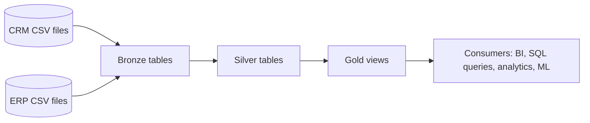
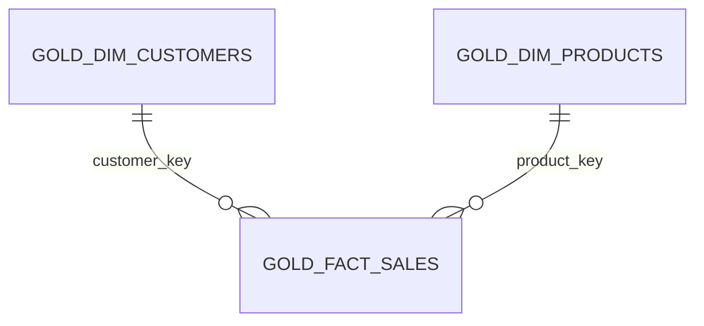

# Data Warehouse Project

## Overview

This repository contains a SQL Server-based data warehouse built with a Bronze, Silver, and Gold architecture.

The implementation loads raw CRM and ERP CSV files into Bronze tables, standardizes and enriches the data in Silver tables, and exposes business-ready Gold views for analytics and reporting.

The design and transformations documented below are based only on the repository contents:
- SQL scripts in `scripts/`
- data quality checks in `test/`
- source files in `datasets/`
- documentation in `docs/`

## Project Objectives

The repository implements a layered warehouse with these observable objectives:

1. Preserve raw source data in Bronze for traceability.
2. Clean, standardize, and validate source data in Silver.
3. Combine CRM and ERP data into a dimensional model in Gold.
4. Provide a sales mart for BI, ad-hoc SQL, and downstream analysis.
5. Support repeatable full refresh loads with simple SQL scripts.

## Repository Structure

| Path | Purpose |
|---|---|
| [README.md](README.md) | Project documentation. |
| [datasets/source_crm/](datasets/source_crm/) | CRM source CSV files. |
| [datasets/source_erp/](datasets/source_erp/) | ERP source CSV files. |
| [docs/](docs/) | Data model, architecture, and naming documentation. |
| [scripts/init_database.sql](scripts/init_database.sql) | Creates the database and schemas. |
| [scripts/bronze/ddl_bronze.sql](scripts/bronze/ddl_bronze.sql) | Creates Bronze tables. |
| [scripts/bronze/proc_load_bronze.sql](scripts/bronze/proc_load_bronze.sql) | Loads CSV files into Bronze tables. |
| [scripts/silver/ddl_silver.sql](scripts/silver/ddl_silver.sql) | Creates Silver tables. |
| [scripts/silver/proc_load_silver.sql](scripts/silver/proc_load_silver.sql) | Transforms Bronze data into Silver tables. |
| [scripts/gold/ddl_gold.sql](scripts/gold/ddl_gold.sql) | Creates Gold views. |
| [test/quality_checks_silver.sql](test/quality_checks_silver.sql) | Validates Silver data quality. |
| [test/quality_checks_gold.sql](test/quality_checks_gold.sql) | Validates Gold relationships and uniqueness. |

## Architecture

The repository implements a classic three-layer warehouse pattern:



### Layer Summary

| Layer | Object Type | Load Method | Role |
|---|---|---|---|
| Bronze | Tables | Full load with truncate and insert | Raw landing zone for source files. |
| Silver | Tables | Full load with truncate and insert | Cleansed and standardized integration layer. |
| Gold | Views | No physical load | Business-ready dimensional layer. |

## Database Design

The warehouse is implemented in a single database named `DataWarehouse` with three schemas:

| Schema | Purpose |
|---|---|
| `bronze` | Raw source landing tables. |
| `silver` | Cleansed and standardized staging tables. |
| `gold` | Business-facing views for analytics. |

The Gold layer is modeled as a star schema for sales analysis:



## Data Model

The Gold layer documents a dimensional model with two dimensions and one fact view.

| Object | Type | Grain | Notes |
|---|---|---|---|
| `gold.dim_customers` | View | One row per customer record | Enriched customer dimension built from CRM and ERP sources. |
| `gold.dim_products` | View | One row per current product record | Product dimension with category enrichment. |
| `gold.fact_sales` | View | One row per sales transaction line | Sales fact joined to customer and product surrogate keys. |

## ETL Workflow

The implemented load sequence is:

1. `scripts/init_database.sql` drops and recreates the `DataWarehouse` database and creates the `bronze`, `silver`, and `gold` schemas.
2. `scripts/bronze/ddl_bronze.sql` creates raw landing tables.
3. `scripts/bronze/proc_load_bronze.sql` truncates Bronze tables and bulk loads the CSV files.
4. `scripts/silver/ddl_silver.sql` creates Silver tables, including technical load-date columns.
5. `scripts/silver/proc_load_silver.sql` truncates Silver tables and applies cleansing and standardization logic.
6. `scripts/gold/ddl_gold.sql` creates Gold views over the Silver layer.
7. `test/quality_checks_silver.sql` and `test/quality_checks_gold.sql` validate data quality and relationships.

### Source-to-Target Flow

| Source | Bronze | Silver | Gold |
|---|---|---|---|
| CRM customer data | `bronze.crm_cust_info` | `silver.crm_cust_info` | `gold.dim_customers` |
| CRM product data | `bronze.crm_prd_info` | `silver.crm_prd_info` | `gold.dim_products` |
| CRM sales data | `bronze.crm_sales_details` | `silver.crm_sales_details` | `gold.fact_sales` |
| ERP customer birthdate/gender data | `bronze.erp_cust_az12` | `silver.erp_cust_az12` | `gold.dim_customers` |
| ERP customer location data | `bronze.erp_loc_a101` | `silver.erp_loc_a101` | `gold.dim_customers` |
| ERP product category data | `bronze.erp_px_cat_g1v2` | `silver.erp_px_cat_g1v2` | `gold.dim_products` |

## Data Quality Checks

The repository includes SQL-based validation scripts rather than automated constraints.

| File | Main Checks |
|---|---|
| [test/quality_checks_silver.sql](test/quality_checks_silver.sql) | Null or duplicate keys, unwanted spaces, standard values, invalid dates, invalid date ordering, inconsistent sales calculations, out-of-range birthdates, and normalized country/maintenance values. |
| [test/quality_checks_gold.sql](test/quality_checks_gold.sql) | Uniqueness of surrogate keys and referential integrity between `gold.fact_sales`, `gold.dim_customers`, and `gold.dim_products`. |

## Tables and Views

### Bronze Layer

| Object | Purpose | Input Source | Output Usage |
|---|---|---|---|
| `bronze.crm_cust_info` | Stores raw CRM customer records as received. | `datasets/source_crm/cust_info.csv` | Feeds `silver.crm_cust_info`. |
| `bronze.crm_prd_info` | Stores raw CRM product records. | `datasets/source_crm/prd_info.csv` | Feeds `silver.crm_prd_info`. |
| `bronze.crm_sales_details` | Stores raw CRM sales transactions. | `datasets/source_crm/sales_details.csv` | Feeds `silver.crm_sales_details`. |
| `bronze.erp_loc_a101` | Stores raw ERP customer location data. | `datasets/source_erp/LOC_A101.csv` | Feeds `silver.erp_loc_a101`. |
| `bronze.erp_cust_az12` | Stores raw ERP customer birthdate and gender data. | `datasets/source_erp/CUST_AZ12.csv` | Feeds `silver.erp_cust_az12`. |
| `bronze.erp_px_cat_g1v2` | Stores raw ERP product category mappings. | `datasets/source_erp/PX_CAT_G1V2.csv` | Feeds `silver.erp_px_cat_g1v2`. |

### Silver Layer

| Object | Purpose | Input Source | Output Usage |
|---|---|---|---|
| `silver.crm_cust_info` | Cleans customer names, standardizes marital status and gender, and keeps the latest record per customer. | `bronze.crm_cust_info` | Feeds `gold.dim_customers`. |
| `silver.crm_prd_info` | Parses product/category keys, standardizes product line values, converts dates, and derives product end dates. | `bronze.crm_prd_info` | Feeds `gold.dim_products`. |
| `silver.crm_sales_details` | Converts date integers to dates and corrects invalid sales and price values. | `bronze.crm_sales_details` | Feeds `gold.fact_sales`. |
| `silver.erp_loc_a101` | Normalizes customer IDs and country names. | `bronze.erp_loc_a101` | Feeds `gold.dim_customers`. |
| `silver.erp_cust_az12` | Removes the `NAS` prefix from customer IDs, removes future birthdates, and standardizes gender values. | `bronze.erp_cust_az12` | Feeds `gold.dim_customers`. |
| `silver.erp_px_cat_g1v2` | Carries forward ERP category mapping data for product enrichment. | `bronze.erp_px_cat_g1v2` | Feeds `gold.dim_products`. |

### Gold Layer

| Object | Purpose | Input Source | Output Usage |
|---|---|---|---|
| `gold.dim_customers` | Business customer dimension enriched with CRM and ERP attributes. | `silver.crm_cust_info`, `silver.erp_cust_az12`, `silver.erp_loc_a101` | Used by `gold.fact_sales` and reporting queries. |
| `gold.dim_products` | Business product dimension enriched with category and maintenance attributes. | `silver.crm_prd_info`, `silver.erp_px_cat_g1v2` | Used by `gold.fact_sales` and product analysis. |
| `gold.fact_sales` | Sales fact view combining sales transactions with customer and product keys. | `silver.crm_sales_details`, `gold.dim_customers`, `gold.dim_products` | Main analytical sales dataset for BI and ad hoc analysis. |

## SQL Techniques Used

| Technique | Where It Appears | Purpose |
|---|---|---|
| `BULK INSERT` | Bronze load procedure | Loads CSV files into raw tables. |
| `TRUNCATE TABLE` + `INSERT` | Bronze and Silver load procedures | Implements repeatable full refresh loads. |
| `CREATE OR ALTER PROCEDURE` | Load procedures | Creates idempotent load routines. |
| `CREATE VIEW` | Gold DDL | Exposes the business layer without storing duplicated data. |
| `ROW_NUMBER()` | Silver and Gold logic | Deduplicates customer records and generates surrogate keys. |
| `LEAD()` | Silver product logic | Derives product end dates from the next start date. |
| `CASE` | Silver transformations | Normalizes codes and repairs invalid values. |
| `LEFT JOIN` | Gold views | Combines integrated data from multiple sources. |
| `TRIM`, `UPPER`, `SUBSTRING`, `REPLACE` | Silver transformations | Cleans strings and parses business keys. |
| `CAST`, `ISNULL`, `COALESCE`, `NULLIF`, `ABS`, `LEN` | Silver transformations | Handles type conversion, null safety, and data correction. |

## Business Rules Implemented

The repository implements the following rules in the Silver and Gold layers:

1. Keep the latest customer record per `cst_id` using `ROW_NUMBER()` over `cst_create_date`.
2. Convert marital status codes `S` and `M` into `Single` and `Married`.
3. Convert gender codes `F` and `M` into `Female` and `Male`, with `n/a` as the fallback.
4. Split CRM product keys into category and product components.
5. Map product line codes `M`, `R`, `S`, and `T` to human-readable labels.
6. Default missing product cost values to `0` in Silver.
7. Derive `prd_end_dt` as one day before the next product start date.
8. Convert sales dates from integer format to `DATE` and set invalid dates to `NULL`.
9. Recalculate sales when the source value is missing or inconsistent with `quantity * price`.
10. Derive unit price when the source value is invalid or missing.
11. Remove the `NAS` prefix from ERP customer IDs.
12. Null out future birthdates in ERP customer data.
13. Normalize ERP country values such as `DE`, `US`, and `USA`.
14. Use CRM gender first in Gold, then fall back to ERP gender when CRM is `n/a`.
15. Keep only current products in `gold.dim_products` by filtering to rows where `prd_end_dt IS NULL`.

## Technologies Used

| Technology | Evidence in Repository | Notes |
|---|---|---|
| SQL Server | `USE master;`, `CREATE DATABASE`, `BULK INSERT`, schemas, procedures, and views | Inferred from T-SQL syntax and load patterns. |
| T-SQL | All SQL scripts | Primary implementation language. |
| CSV files | `datasets/source_crm/` and `datasets/source_erp/` | Source format for Bronze loads. |
| Mermaid | This README | Used here to document the architecture and star schema. |

Not specified in repository:
- scheduling or orchestration tool
- BI or reporting tool name
- deployment platform
- author name

## Setup Instructions

1. Install SQL Server or another SQL engine that supports the T-SQL features used in this repository.
2. Clone the repository and keep the source CSV folder structure intact.
3. Update the hard-coded file paths in `scripts/bronze/proc_load_bronze.sql` if your local folder path differs from `C:\sql-data-warehouse-project\`.
4. Run the scripts in this order:

```sql
-- 1. Create database and schemas
scripts/init_database.sql

-- 2. Create Bronze objects
scripts/bronze/ddl_bronze.sql
scripts/bronze/proc_load_bronze.sql

-- 3. Create Silver objects
scripts/silver/ddl_silver.sql
scripts/silver/proc_load_silver.sql

-- 4. Create Gold views
scripts/gold/ddl_gold.sql

-- 5. Run checks
test/quality_checks_silver.sql
test/quality_checks_gold.sql
```

5. Execute the load procedures:

```sql
EXEC bronze.load_bronze;
EXEC silver.load_silver;
```

6. Query the Gold views for analysis.

## Usage Guide

1. Rebuild the warehouse when you want a fresh load.
2. Run the Bronze procedure to ingest the CSV files.
3. Run the Silver procedure to cleanse and standardize the raw data.
4. Run the Silver and Gold quality checks to confirm data consistency.
5. Query `gold.dim_customers`, `gold.dim_products`, and `gold.fact_sales` for reporting.

## Sample Queries

### 1. Sales by Country

```sql
SELECT
	c.country,
	SUM(f.sales_amount) AS total_sales
FROM gold.fact_sales f
LEFT JOIN gold.dim_customers c
	ON f.customer_key = c.customer_key
GROUP BY c.country
ORDER BY total_sales DESC;
```

### 2. Sales by Product Category

```sql
SELECT
	p.category,
	SUM(f.sales_amount) AS total_sales,
	SUM(f.quantity) AS total_quantity
FROM gold.fact_sales f
LEFT JOIN gold.dim_products p
	ON f.product_key = p.product_key
GROUP BY p.category
ORDER BY total_sales DESC;
```

### 3. Top Customers by Sales

```sql
SELECT TOP 10
	c.customer_number,
	c.first_name,
	c.last_name,
	SUM(f.sales_amount) AS total_sales
FROM gold.fact_sales f
LEFT JOIN gold.dim_customers c
	ON f.customer_key = c.customer_key
GROUP BY c.customer_number, c.first_name, c.last_name
ORDER BY total_sales DESC;
```

### 4. Recent Orders

```sql
SELECT TOP 20
	order_number,
	order_date,
	shipping_date,
	due_date,
	sales_amount
FROM gold.fact_sales
ORDER BY order_date DESC, order_number DESC;
```

## Key Learnings

1. A Bronze-to-Silver-to-Gold design keeps raw data traceable while still producing analytics-ready outputs.
2. Full refresh loading is simple to reason about, especially for small warehouse projects.
3. Silver-layer cleansing is essential because the source data contains inconsistent codes, trimmed strings, invalid dates, and incorrect sales calculations.
4. Gold-layer views reduce duplication and make business logic easier to consume.
5. The repository is a good example of combining CRM and ERP data into a single sales mart.

## Future Enhancements

1. Parameterize the source file paths instead of hard-coding them in the Bronze load procedure.
2. Add row-count logging and load audit tables.
3. Add indexes or constraints if the warehouse grows beyond the current learning-scale footprint.
4. Introduce incremental loading for larger source volumes.
5. Add a scheduled orchestration layer if automated refreshes are needed.

## Author

**Sourabh Saxena**

B.Tech CSE (AI & ML) Student | Aspiring Data Scientist & AI/ML Developer

- GitHub: https://github.com/sourabh-550
- LinkedIn: https://www.linkedin.com/in/sourabh55/

If you have any feedback, suggestions, or collaboration opportunities, feel free to connect with me.